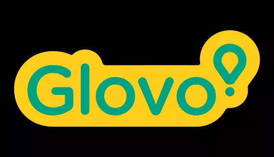

# Pizza-Hut

<!DOCTYPE html>
<html lang="es">
<head>
    <meta charset="UTF-8">
    <meta http-equiv="X-UA-Compatible" content="IE=edge">
    <meta name="viewport" content="width=device-width, initial-scale=1.0">
    
    <title>Pizzahot</title>
    <link rel="stylesheet" type="text/css" href="sty.css">

</head>
<!--Menu-->

<body>
    <header>
        

        <nav>
            <a href="navegacion.html" class="nav_link"> NAVEGA POR EL MENÚ</a>
            <a href="tienda.html" class="nav_link">LOCALIZA NUESTRAS TIENDAS</a>
            <a href="oferta.html" class="nav_link">OFERTAS</a>
        </nav>
    </header>
    <!--Imagen de fondo y contenido..-->
    

        
        
¡PIDE Y PAGA EN LÍNEA! ¿CÓMO QUIERES ORDENAR?

    

     
    <!--Tags de inicio-->
    

        

            <figure>
                
            </figure>
            

                <h3>No te pierdas ninguna oferta</h3>
                
No te pierdas los Martes locos compra una y lleva 2.

                <a href="oferta.html">Ingresa</a>
            

        

        

            <figure>
                
            </figure>
            

                <h3>Encuéntranos</h3>
                
Siempre estamos cerca de ti, tenemos Restaurantes en varios puntos y ahora a un solo click.

                <a href="tienda.html">Ingresa</a>
            

        

        

            <figure>
                
            </figure>
            

                <h3>Uber Eats</h3>
                
Pide a domicilio tu comida Pizza Hut preferida con Uber Eats

                <a href="#">Pide ahora</a>
            

        

        

            <figure>
                
            </figure>
            

                <h3>Glovo</h3>
                
Te llevamos a casa tu comida Pizza Hut preferida con Glovo

                <a href="#">Pide ahora</a>
            

        

    

     

    <!--Pie de Pagina-->
    <footer class="pie-pagina">
        

            

                <figure>
                    
                </figure>
            

            

                <h2>SOBRE NOSOTROS</h2>
                <h2>CONTÁCTOS</h2>
                
SIEMPRE ENTRAGAMOS MÁS

            

            

                <h2>SIGUENOS</h2>
                <h2>CORPORATIVO</h2>
            

        

        

            <small>&Copy Joel Mena; <b>Pizza Hut</b> - Todos los Derechos Reservados.</small>
        

    </footer>
    
</body>

</html>
